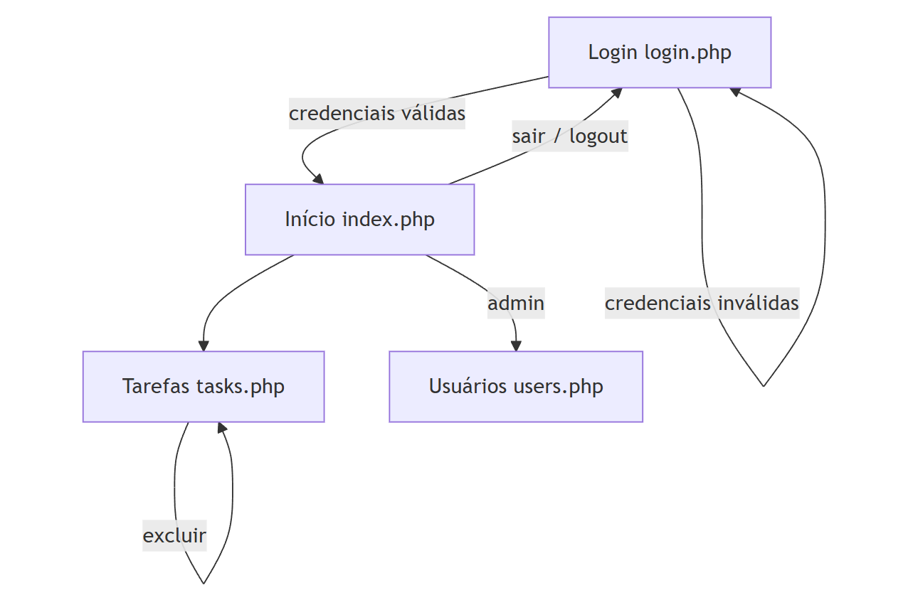
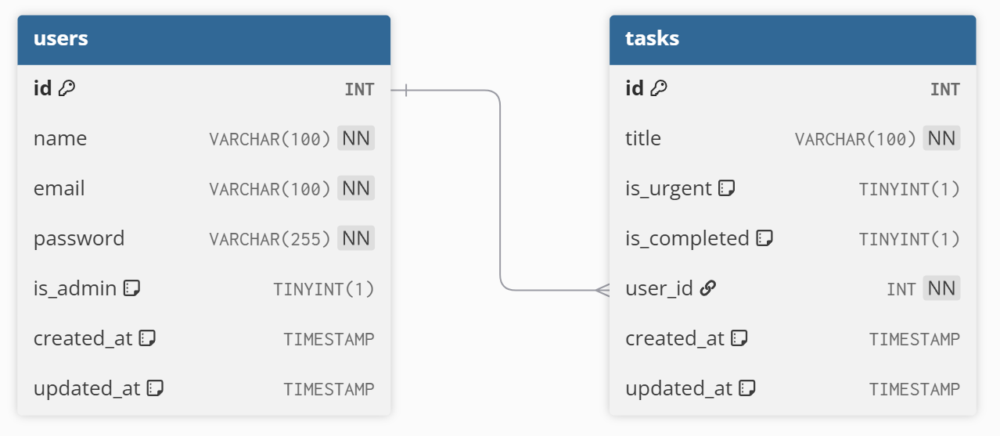

# Atividade 1: Relembrando Back-end I

Esta atividade tem como objetivo praticar o uso do PDO, estudado nas últimas aulas, e relembrar os conteúdos trabalhados na disciplina de Desenvolvimento Back-end I. 

## Descrição da Atividade

Você deverá desenvolver uma aplicação bem simples de controle de tarefas, contendo:

- uma página para login;
- uma página inicial com um menu (links para as demais páginas);
- uma página com a listagem das tarefas do usuário logado;
- uma página com a listagem de todos os usuário do sistema.

### **Principais regras**

- Cada usuário vê apenas as suas tarefas;
- Apenas o administrador tem acesso à página de usuários;
- O usuário pode deletar suas tarefas.
- O acesso às paginas inicial, usuários e tarefas requer um usuário autenticado.

### **Observações**

- Mantenha a implementação simples e enxuta, sem biblitoecas externas nem frameworks;
- O foco não é padrão de projeto, o objetivo é praticar o uso do PDO, o envio de dados a partir de formulários e a dinâmica de controle de sessões;
- Capriche na programação server-side e não se preocupe com estilização.

### Diagrama de Fluxo



## Etapas Principais

### 1. Revise a sintaxe do PDO

- Acesse a página [Guia Rápido PDO](https://www.notion.so/Guia-R-pido-PDO-26258e4e0e1980199066e10d240e7d29?pvs=21) para revisar o uso básico do PDO. Muitos dos exemplos que estão lá podem ser utilizados na próxima etapa.

### 2. Prepare o banco de dados e a conexão

- No MySQL, crie um banco dados com o nome de sua preferência;
- Crie um script para conexão com o banco de dados (por exemplo, conexao.php) que será importado por todos os scripts que conectarem ao banco;
- Crie um script (por exemplo bd.php) para criar as tabelas:



- Pode usar as seguintes instruções SQL:

```sql
-- Tabela de usuários
CREATE TABLE users (
    id INT AUTO_INCREMENT PRIMARY KEY,
    name VARCHAR(100) NOT NULL,
    email VARCHAR(100) NOT NULL UNIQUE,
    password VARCHAR(255) NOT NULL,
    is_admin TINYINT(1) DEFAULT 0,
    created_at TIMESTAMP DEFAULT CURRENT_TIMESTAMP,
    updated_at TIMESTAMP DEFAULT CURRENT_TIMESTAMP ON UPDATE CURRENT_TIMESTAMP
) ENGINE=InnoDB;

-- Tabela de tarefas
CREATE TABLE tasks (
    id INT AUTO_INCREMENT PRIMARY KEY,
    title VARCHAR(100) NOT NULL,
    is_urgent TINYINT(1) DEFAULT 0,
    is_completed TINYINT(1) DEFAULT 0,
    user_id INT NOT NULL,
    created_at TIMESTAMP DEFAULT CURRENT_TIMESTAMP,
    updated_at TIMESTAMP DEFAULT CURRENT_TIMESTAMP ON UPDATE CURRENT_TIMESTAMP,
    FOREIGN KEY (user_id) REFERENCES users(id) ON DELETE CASCADE
) ENGINE=InnoDB;
```

- No mesmo script, insera os seguintes dados de exemplo, controlando transações:

```php
$users = [
    ["Admnistrador do Sistema", "admin@email.com", password_hash("admin123", PASSWORD_DEFAULT), 1],
    ["Alvirinha Souza", "alvirinha@email.com", password_hash("alvirinha", PASSWORD_DEFAULT), 0],
    ["Elesbão Silva", "elesbao@email.com", password_hash("elesbao", PASSWORD_DEFAULT), 0],
    ["Dorotéia Virsh", "doroteia@email.com", password_hash("doroteia", PASSWORD_DEFAULT), 0],
    ["Genoveva da Rocha", "genoveva@email.com", password_hash("genoveva", PASSWORD_DEFAULT), 0],
    ["Bernardino Costa", "bernardino@email.com", password_hash("bernardino", PASSWORD_DEFAULT), 0],
];

$tasks = [
    ['title' => 'Implementar autenticação JWT', 'is_urgent' => 1, 'is_completed' => 0, 'user_id' => 2],
    ['title' => 'Revisar documentação do sistema', 'is_urgent' => 0, 'is_completed' => 1, 'user_id' => 2],
    ['title' => 'Criar testes unitários', 'is_urgent' => 1, 'is_completed' => 0, 'user_id' => 2],
    ['title' => 'Configurar banco de dados', 'is_urgent' => 0, 'is_completed' => 0, 'user_id' => 3],
    ['title' => 'Otimizar consultas SQL', 'is_urgent' => 1, 'is_completed' => 1, 'user_id' => 3],
    ['title' => 'Desenvolver tela de login', 'is_urgent' => 1, 'is_completed' => 0, 'user_id' => 4],
    ['title' => 'Ajustar layout responsivo', 'is_urgent' => 0, 'is_completed' => 1, 'user_id' => 4],
    ['title' => 'Corrigir bug no formulário', 'is_urgent' => 1, 'is_completed' => 0, 'user_id' => 4],
    ['title' => 'Implementar cache com Redis', 'is_urgent' => 1, 'is_completed' => 0, 'user_id' => 5],
    ['title' => 'Atualizar dependências do projeto', 'is_urgent' => 0, 'is_completed' => 0, 'user_id' => 5],
    ['title' => 'Gerar relatório mensal', 'is_urgent' => 0, 'is_completed' => 1, 'user_id' => 5],
    ['title' => 'Criar API de tarefas', 'is_urgent' => 1, 'is_completed' => 0, 'user_id' => 6],
    ['title' => 'Testar integração com frontend', 'is_urgent' => 0, 'is_completed' => 1, 'user_id' => 6]
];
```

Os elementos dos arrays **$users** e **$tasks** apresentam estruturas diferentes justamente para você praticar formas diferentes de associar os valores no uso dos métodos **prepare()** e **execute()**.

### 3. Implemente a página inicial

- A página inicial deve possui apenas um menu simples com as opções:
    - **Minhas Tarefas**: link página de tarefas;
    - **Usuários do Sistema**: link para página de usuários (exibir essa opção apenas se o usuário for um administrador);
    - **Sair**:  link para a página de login.
- Se a página for acessada sem um usuário autenticado, redirecionar para a página de login.

### 4. Implemente a página de login

- Crie um formulário onde o usuário informa seu email e sua senha para logar no sistema;
- Utilize a função **password_verify()** para verificar a senha, já que foram salvas no banco de dados usando a função password_hash();
- Se o login for bem sucedido, redirecione para a pagina inicial (index.php). Caso contrário, exiba uma mensagem de erro;
- A página de login também é responsável pelo logout. Assim, o script deve sempre destruir a sessão possivelmente existente quando a página é carregada.

### 5. Implemente a página de tarefas

- A página deve apresentar uma tabela com as tarefas do usuário autenticado;
- Se a página for acessado sem um usuário autenticado, redirecionar para a página de login;
- Cada linha da tabela deve apresentar um botão para excluir a respectiva tarefa;
- Use o método POST para implementar a exclusão.

### 6. Implemente a página de usuários

- A página deve apresentar uma tabela com a lista de todos os usuário do sistema;
- Somente um administrador pode acessar essa página;
- Se não houver usuário autenticado, deve-se redirecionar para a página de login;
- Se o usuário autenticado não for um administrador, deve-se exibir uma mensagem explicando que o usuário não está autorizado, além de um link para retornar à página inicial.